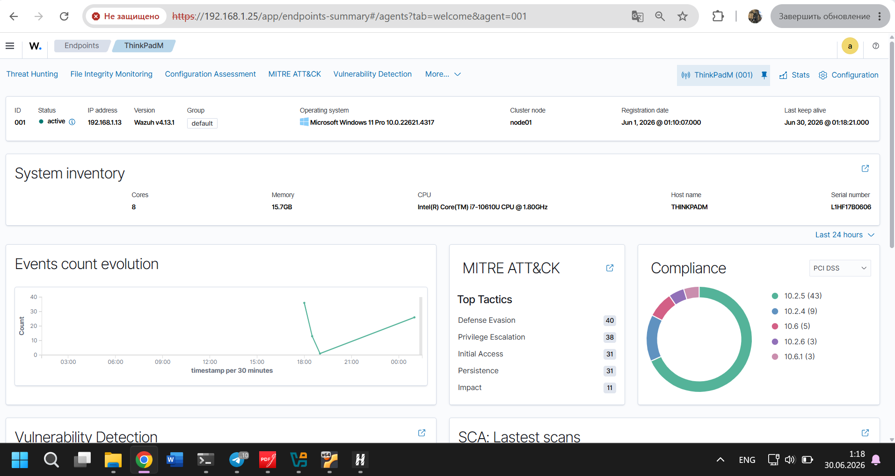
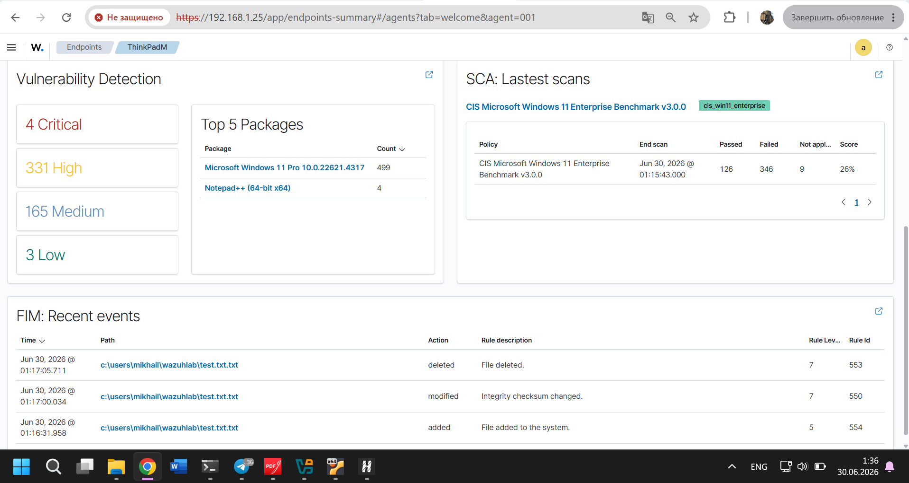
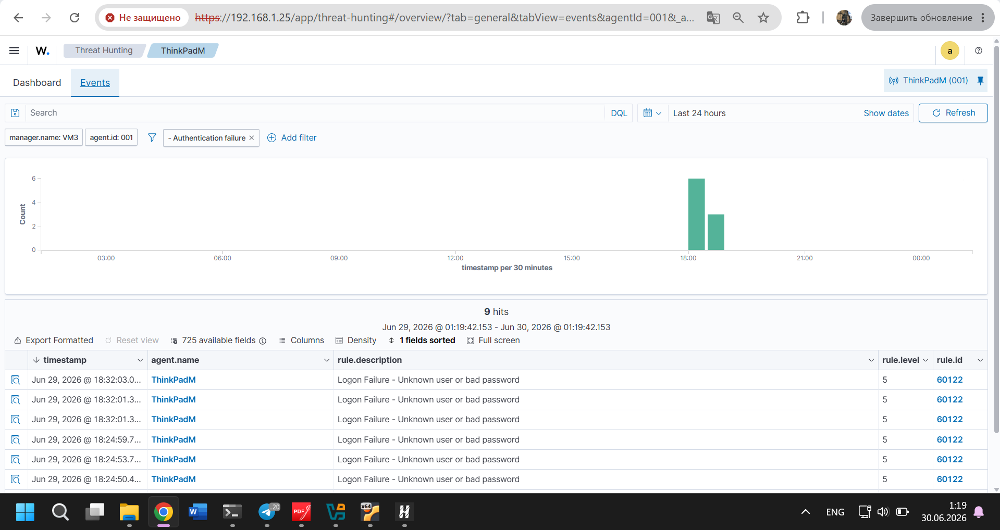
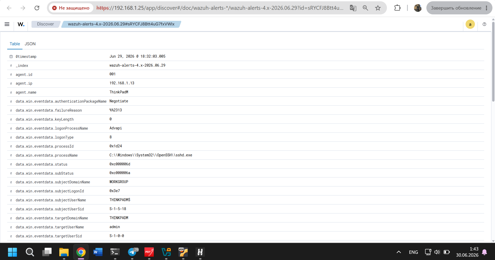
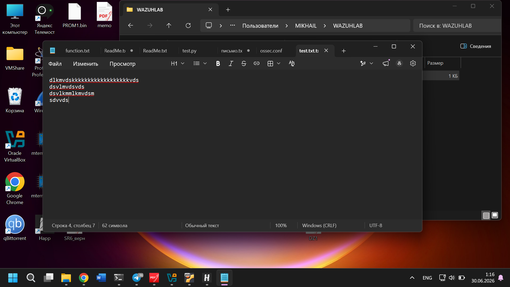
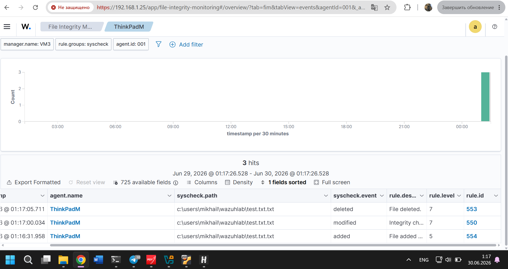

# 🛡️ Wazuh SIEM Homelab

> Personal cybersecurity laboratory built with Wazuh to practice SOC Level 1 operations, including security monitoring, alert triage, authentication analysis, and File Integrity Monitoring (FIM).

---

## 📖 About

This project demonstrates the deployment of a personal Security Information and Event Management (SIEM) laboratory using Wazuh.

The main objective of this homelab is to gain practical hands-on experience with SOC Level 1 responsibilities by collecting, monitoring, and analyzing security events generated on a Windows endpoint.

The environment was built from scratch using a Linux virtual machine running Wazuh and a Windows workstation configured with the Wazuh Agent.

---

# 🎯 Project Goals

- Deploy a functional SIEM environment
- Connect Windows endpoint to Wazuh
- Practice log collection and monitoring
- Simulate security events
- Perform alert triage
- Improve practical SOC Level 1 skills

---

# 🏗️ Lab Architecture
                       +-----------------------------+
                       |      Windows 11 Host        |
                       |-----------------------------|
                       | • Wazuh Agent               |
                       | • OpenSSH Server            |
                       | • Windows Event Logs        |
                       | • File Integrity Monitor    |
                       +-------------+---------------+
                                     |
                                     |
                          Security Events
                                     |
                                     ▼
                     +-------------------------------+
                     |        Ubuntu Server          |
                     |-------------------------------|
                     | • Wazuh Manager               |
                     | • Wazuh Indexer               |
                     | • Wazuh Dashboard             |
                     +-------------------------------+

---

# 💻 Environment

| Component | Description |
|-----------|-------------|
| SIEM Platform | Wazuh |
| Server OS | Ubuntu Linux |
| Endpoint | Windows 11 |
| Virtualization | VirtualBox |
| Remote Access | OpenSSH |
| Monitoring | Wazuh Agent |

---

# 🛠️ Technologies

- Wazuh
- Ubuntu Linux
- Windows 11
- VirtualBox
- OpenSSH Server
- File Integrity Monitoring (FIM)
- Windows Event Logs
- Nmap
- Git
- GitHub

---

# 🔬 Implemented Scenarios

---

## Scenario 1 — Wazuh Deployment

### Objective

Deploy a personal SIEM laboratory.

### Actions

- Installed Ubuntu Linux virtual machine.
- Installed and configured Wazuh.
- Configured Wazuh Dashboard.
- Installed Wazuh Agent on Windows.
- Connected Windows endpoint to Wazuh.
- Verified successful communication between the server and the agent.

### Result

The SIEM platform successfully collected events from the monitored Windows endpoint.

---

## 📷 Dashboard (Agent)

---

# 🔐 Scenario 2 — SSH Authentication Failure Detection

### Objective

Generate failed SSH authentication attempts and verify Wazuh detection.

### Actions

- Installed OpenSSH Server on Windows.
- Connected to the Windows host via SSH from Ubuntu.
- Generated multiple failed authentication attempts.
- Verified alert generation inside Wazuh.
- Performed initial alert triage.

### Skills Practiced

- Authentication monitoring
- Alert investigation
- Log analysis
- SOC Level 1 triage

### Result

Wazuh successfully detected failed SSH authentication attempts and generated security alerts.

---

## 📷 Authentication Failure

---

# 📂 Scenario 3 — File Integrity Monitoring (FIM)

### Objective

Verify that Wazuh detects filesystem changes in real time.

### Actions

- Configured File Integrity Monitoring.
- Added a custom directory for monitoring.
- Created a file.
- Modified the file.
- Deleted the file.
- Verified alert generation for each operation.

### Skills Practiced

- File Integrity Monitoring
- Security event monitoring
- Alert validation
- Incident investigation

### Result

Wazuh successfully detected every filesystem modification.

---

## 📷 File Created-Modified-Deleted

---

# 🧠 Skills Demonstrated

- SIEM Deployment
- Wazuh Administration
- Windows Agent Configuration
- Linux Administration
- SSH Configuration
- Authentication Monitoring
- File Integrity Monitoring
- Windows Event Log Analysis
- Alert Triage
- Security Event Investigation
- Virtualization
- Basic Incident Analysis

---

# 📚 Lessons Learned

Throughout this project I gained practical experience in deploying a SIEM solution, configuring endpoint monitoring, generating security events, and performing initial security investigations.

The laboratory provided hands-on understanding of how security events are collected, processed, and analyzed within a SOC environment.

---

# 🚀 Roadmap

## Completed

- ✅ Wazuh Deployment
- ✅ Windows Agent Configuration
- ✅ Dashboard Configuration
- ✅ SSH Authentication Monitoring
- ✅ File Integrity Monitoring

## Planned

- ⬜ Sysmon Integration
- ⬜ PowerShell Monitoring
- ⬜ Windows Event ID Analysis
- ⬜ Custom Wazuh Rules
- ⬜ Nmap Detection
- ⬜ MITRE ATT&CK Mapping
- ⬜ Sigma Rules
- ⬜ Additional Attack Simulations

---

# 👨‍💻 About This Project

This homelab is continuously improved as part of my preparation for a Junior SOC Analyst position.

The goal is to build practical cybersecurity skills through hands-on experience with real security monitoring tools and attack simulation scenarios.

---

## ⭐ Author

Petrov M.Y.

Computer Security Student

Bauman Moscow State Technical University (BMSTU)

Interested in:

- SOC
- Blue Team
- SIEM
- Incident Response
- Threat Detection
